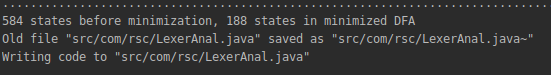
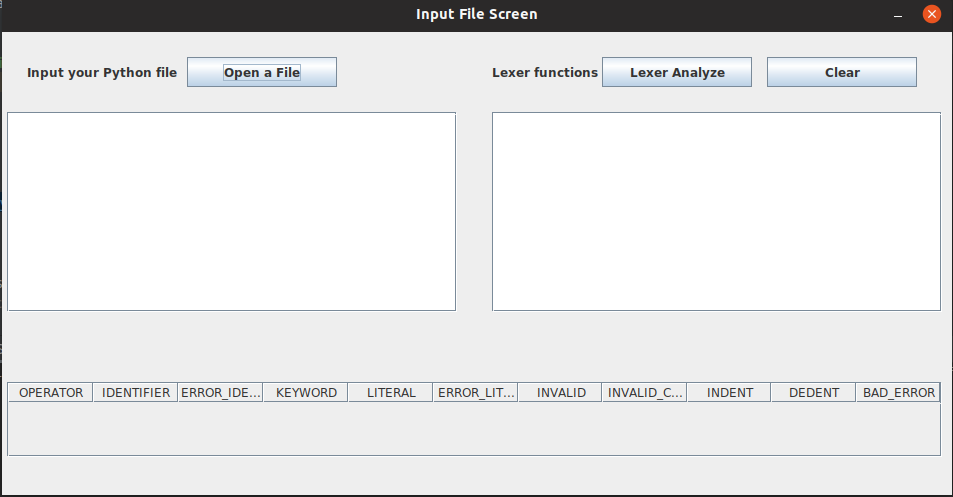
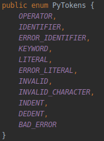
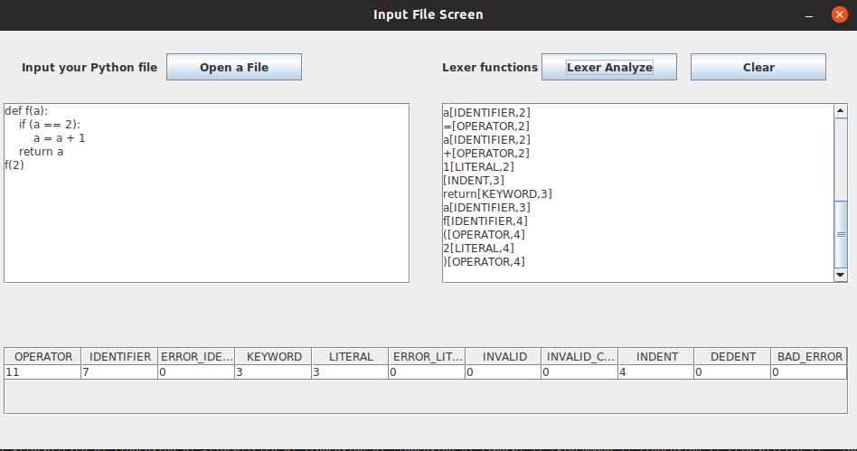

# Python Lexer Analyzer with JFlex
We developed a lexical analyzer for python using JFlex library.

## Prerequisites
- [Java](https://www.java.com/pt_BR/)
- [JFlex](https://www.jflex.de/)

## JFlex
JFlex is a lexical analyzer generator (also known as scanner generator) for Java, written in Java.

### Develop Enviroment
We're using the IntelliJ IDEA. But, you can do this on command line if you want.

### Getting Started
Clone this rep by using
> $ git clone https://github.com/chrismachado/Python-Lexer-Analyzer.git

### Running the Analyzer
First of all, you need the Lexical class for it. So, you can get it with by running
the *bin/LexerGenMain*, that should be the result:

After that, you need to run the GUI *view/InputPyFileScreen*, than choose your Python file.
We have some examples in *files/*, you could use it or run your own code.

The Python Tokens are listed in to class *bin/PyTokens* as we show. 

PS*: This list will be modified. 

After you load your code, hit the Analyze button and you can see the Token, type and line of it. On bottom side, we show
a table with the amount of each token. Like this.

### Authors
- **[Christiano Machado](https://github.com/chrismachado    )** @ christianomachado10@gmail.com
- **[Anderson Sales](https://github.com/cafs92)** @ andersonsales026@gmail.com 

### Acknowledgments
- **Professor Bruno Silva**

